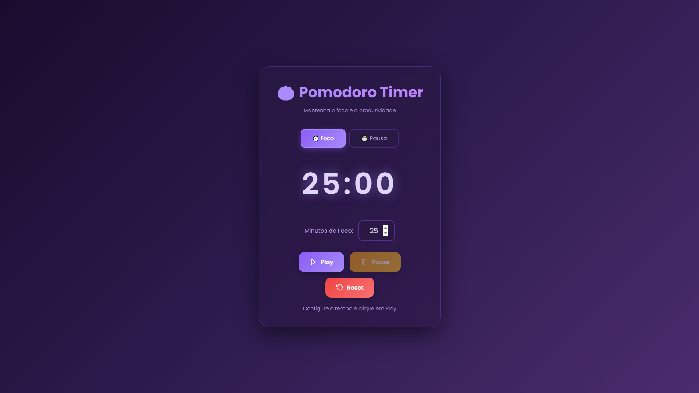

# 🍅 Pomodoro Timer

Um temporizador Pomodoro moderno e elegante com interface dark em tons de roxo, perfeito para manter o foco e a produtividade durante suas sessões de trabalho e estudo.



## ✨ Funcionalidades

### ⏱️ Modo Foco
- Configure sessões de foco de 0 a 30 minutos
- Padrão de 25 minutos (técnica Pomodoro tradicional)
- Áudio ambiente tocando durante toda a sessão

### ☕ Modo Pausa
- Configure pausas de 0 a 15 minutos
- Padrão de 5 minutos para descanso
- Ideal para intervalos entre sessões de foco

### 🎵 Sistema de Áudio
- **Áudio de fundo** (`marrom.mp3`): toca em loop durante a contagem regressiva
- **Alarme** (`alarm.mp3`): toca automaticamente ao finalizar o tempo
- Indicador visual quando o áudio está ativo

### 🎨 Design
- Interface limpa e minimalista
- Tema dark com gradiente roxo/violeta
- Efeitos glassmorphism e sombras suaves
- Totalmente responsivo para desktop e mobile
- Fonte moderna Poppins

### 🎮 Controles
- **Play**: inicia o temporizador e o áudio de fundo
- **Pause**: pausa a contagem e para o áudio
- **Reset**: reseta o tempo configurado
- Validação inteligente: botão Play desabilitado quando tempo = 0

## 🚀 Como Usar

### Estrutura de Arquivos

```
pomodoro-timer/
├── assets/
│   ├── audios/
│   │   ├── Marrom.mp3      # Áudio de fundo (loop)
│   │   └── alarm.mp3       # Áudio de alarme
│   └── images/
│       ├── logo.ico        # Favicon do site
│       ├── logo.png        # Logo em PNG
│       └── screenshot.png  # Screenshot da interface
├── index.html              # Arquivo principal do aplicativo
└── README.md               # Este arquivo
```

### Instalação Local

1. Clone ou baixe este repositório
2. Certifique-se de que a estrutura de pastas está correta
3. Os arquivos de áudio devem estar em `assets/audios/`:
   - `Marrom.mp3` - áudio que tocará durante a contagem
   - `alarm.mp3` - áudio que tocará ao finalizar
4. Abra o arquivo `index.html` no seu navegador

### Deploy no Vercel

1. Faça upload de todos os arquivos (HTML + MP3s) no seu repositório GitHub
2. Conecte o repositório ao Vercel
3. Deploy automático! ✨

Ou use o Vercel CLI:

```bash
npm i -g vercel
vercel
```

## 🎯 Técnica Pomodoro

A Técnica Pomodoro é um método de gerenciamento de tempo desenvolvido por Francesco Cirillo nos anos 80. O conceito é simples:

1. Escolha uma tarefa
2. Configure o timer para 25 minutos (1 Pomodoro)
3. Trabalhe até o alarme tocar
4. Faça uma pausa curta (5 minutos)
5. A cada 4 Pomodoros, faça uma pausa longa (15-30 minutos)

Este timer permite personalizar completamente esses tempos para se adequar ao seu fluxo de trabalho!

## 🛠️ Tecnologias

- **HTML5** - estrutura
- **CSS3** - estilização com gradientes, animações e responsividade
- **JavaScript** - lógica do temporizador e controle de áudio
- **Google Fonts** - tipografia Poppins
- **Lucide Icons** - ícones dos botões

## 📱 Responsividade

O aplicativo é totalmente responsivo e se adapta perfeitamente a:
- 📱 Smartphones
- 📱 Tablets
- 💻 Desktops
- 🖥️ Telas widescreen

## 🎨 Paleta de Cores

- **Fundo**: Gradiente roxo escuro (`#1a0b2e` → `#4a2c6d`)
- **Primária**: Roxo claro (`#a78bfa`, `#c084fc`)
- **Secundária**: Roxo médio (`#8b5cf6`)
- **Texto**: Lavanda clara (`#e0d4f7`, `#b39ddb`)

## 🔊 Requisitos de Áudio

Os arquivos de áudio devem estar na pasta `assets/audios/`:
- `Marrom.mp3` - Recomendado: som ambiente, música calma ou ruído branco
- `alarm.mp3` - Recomendado: som de notificação curto e claro

## 📄 Licença

Este projeto é livre para uso pessoal e comercial.

## 🤝 Contribuições

Sugestões e melhorias são bem-vindas! Sinta-se à vontade para fazer um fork e enviar pull requests.

## 💡 Dicas de Uso

- Use fones de ouvido para uma experiência mais imersiva
- Experimente diferentes tempos para encontrar seu ritmo ideal
- Combine com música ambiente de foco (lofi, classical, ambient)
- Mantenha um bloco de notas próximo para anotar ideias durante as pausas

---

Desenvolvido com 💜 para aumentar sua produtividade

**Bons Pomodoros! 🍅✨**